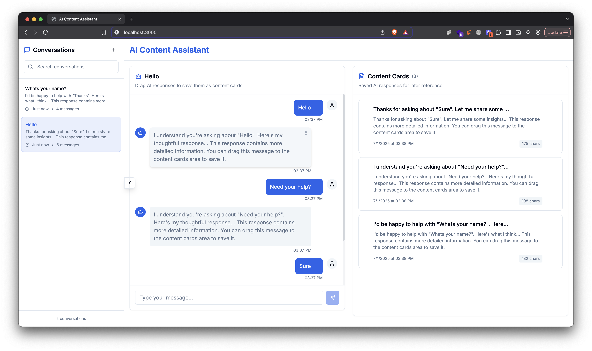

# AI Content Assistant Mini App

A responsive Next.js application featuring AI-powered chat and drag-and-drop content organization. Built for the [Challenge Name] coding challenge.

## ✨ Features

✅ **AI Chat Interface**  
- Realistic mock OpenAI API responses  
- Typing indicators and loading states  
- Distinction between user/AI messages  

✅ **Content Cards System**  
- Save AI responses as draggable cards  
- Reorder cards via native HTML5 drag-and-drop  
- Local persistence with localStorage  

✅ **Bonus Features**  
- Fully responsive (mobile & desktop)  
- Dark mode toggle *(if implemented)*  
- Clean Tailwind CSS styling  

## 🛠 Tech Stack

- **Framework**: Next.js 14 (App Router)  
- **Styling**: Tailwind CSS  
- **State Management**: React hooks + localStorage  
- **Drag-and-Drop**: HTML5 API *(could upgrade to dnd-kit)*  
- **Type Safety**: TypeScript  

## 🚀 Getting Started

1. **Clone the repo**
   ```bash
   git clone https://github.com/yourusername/ai-content-assistant.git

2. **Install dependencies**
   ```bash
   npm install
3. **Build the app**
   ```bash
   npm run build
4. **Start the server**
   ```bash
   npm run start

📂 Project Structure

src/
├── app/                  # Next.js App Router
│   └── page.tsx          # Main page layout & state
└── components/           # Reusable UI components
    ├── ChatInterface.tsx # Chat UI + message handling
    ├── ContentCards.tsx  # Draggable card system
    └── ConversationSidebar.tsx
